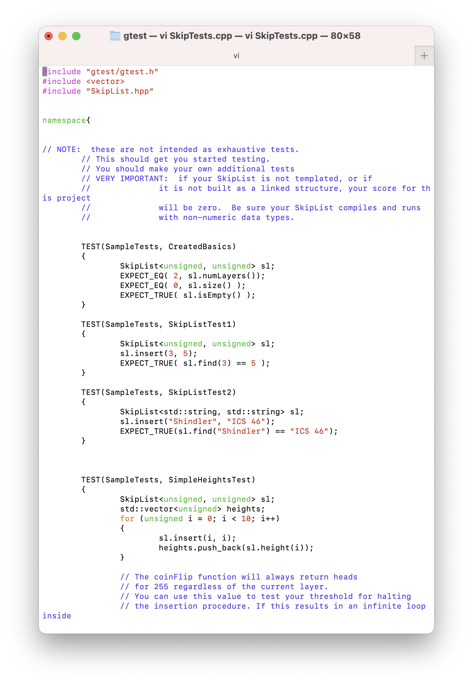
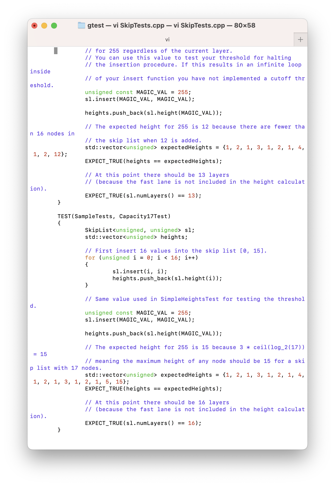
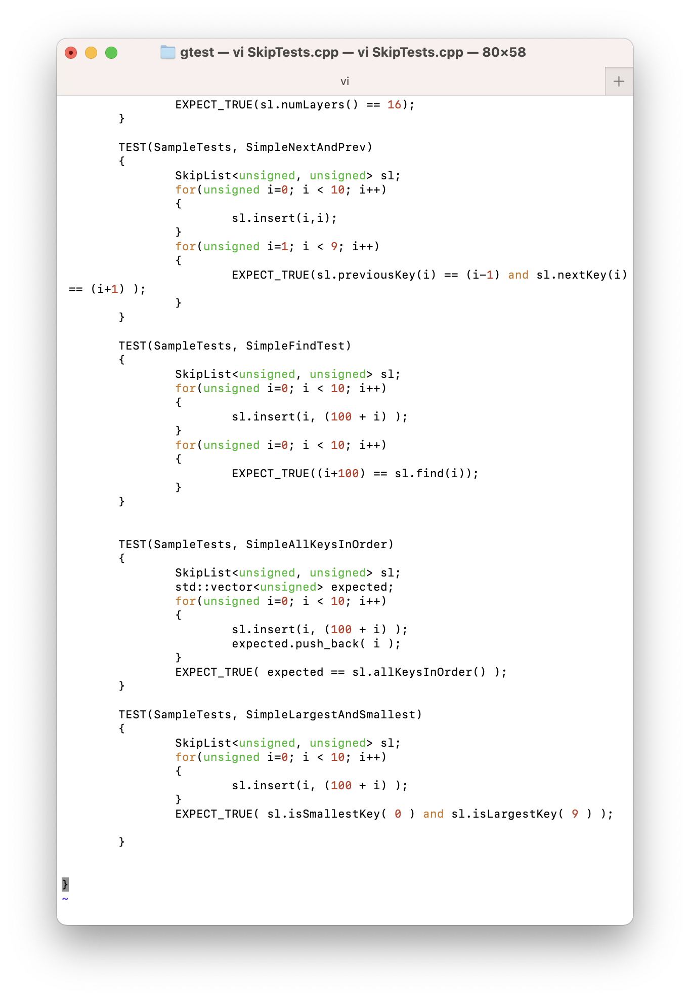

### Description:

This project is about creating a Skip List data structure. It includes `Skip List class`, `flipCoin()`, `find(k)` functions. The Skip List basically will be empty at the beginning, flip the coin to determine probability of going up a layer when inserting a node into the list. When inserting a new node, it always start from the top left position first, search for an appropriate position in the list, flip the coin and insert. 

### Screenshots:

